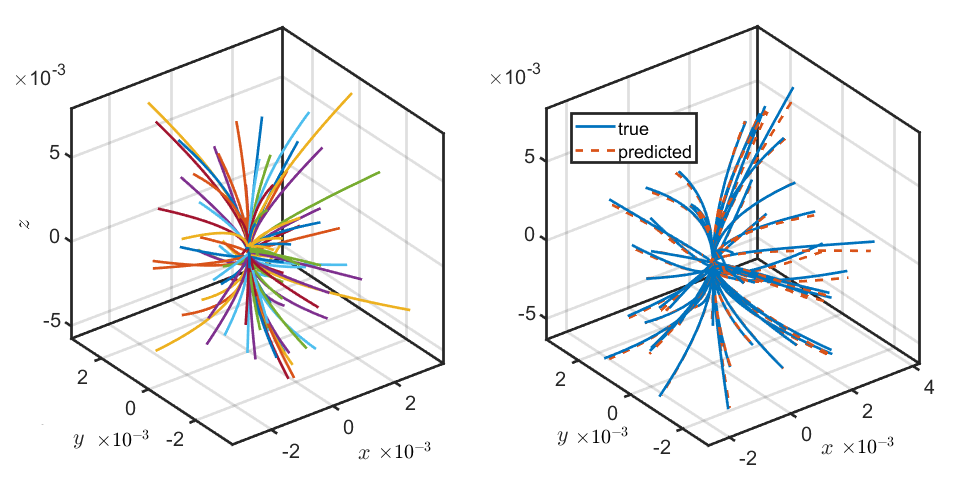
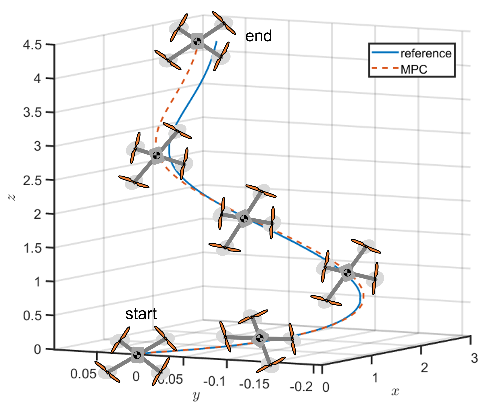

# SE(3) Koopman-MPC: Data-driven Learning and Control of Quadrotor UAVs
In this paper, we propose a novel data-driven approach for learning and control of quadrotor UAVs based on the Koopman operator and extended dynamic mode decomposition (EDMD). Building observables for EDMD based on conventional methods like Euler angles or quaternions to represent orientation is known to involve singularities. To address this issue, we employ a set of physics-informed observables based on the underlying topology of the nonlinear system. We use rotation matrices to directly represent the orientation dynamics and obtain a lifted linear representation of the nonlinear quadrotor dynamics in the SE(3) manifold. This EDMD model leads to accurate prediction and can generalize to several validation sets. Further, we design a linear model predictive controller (MPC) based on the proposed EDMD model to track agile reference trajectories. Simulation results show that the proposed MPC controller can run as fast as 100 Hz and is able to track arbitrary reference trajectories with good accuracy.

Check out our paper on Science Direct: https://www.sciencedirect.com/science/article/pii/S2405896323024242
Here is an Arvix version: https://arxiv.org/abs/2305.03868

## EDMD training and validation
We learning linear predictors ```A``` and ```B``` for a nonlinear quadrotor system using physics-informed observable functions and EDMD.




## MPC
We developed a linear MPC in the lifted states to obtain optimal control at each time step to track a random reference trajectory





## Running the code
To run the MPC, start with the ```main.m``` file from the MECC branch (https://github.com/sriram-2502/KoopmanMPC_Quadrotor/tree/mecc)
